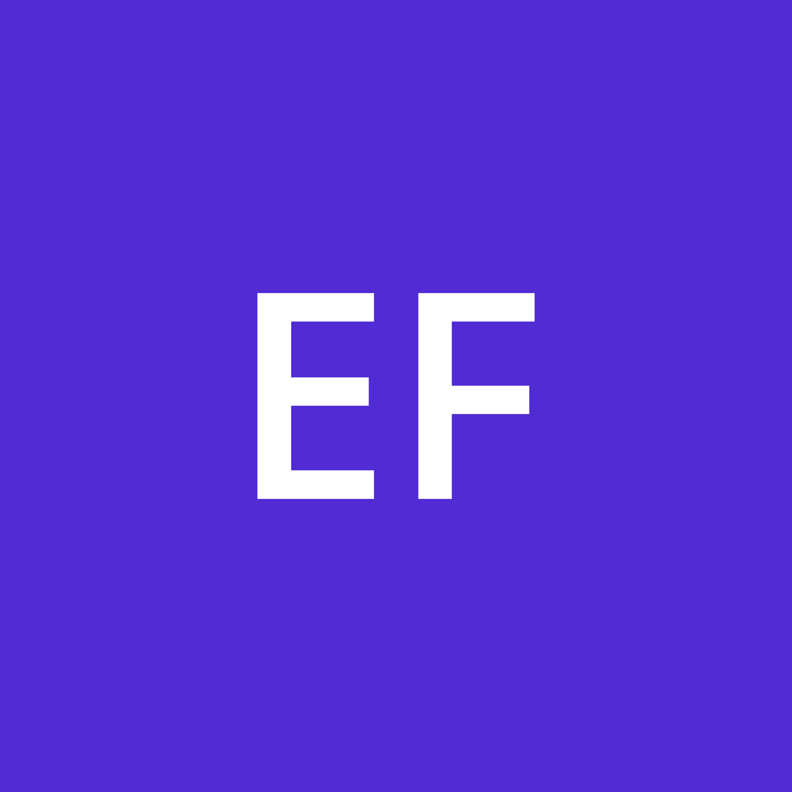
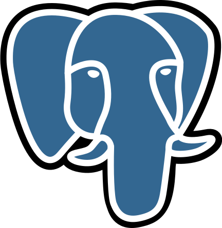
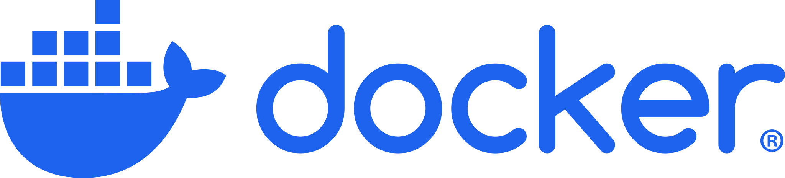
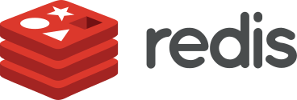

## NoMoreTears

Backend-система, яка представляє платформу для пошуку, підбору та виклику верифікованих профільних спеціалістів (майстрів) для вирішення побутових і технічних проблем клієнтів: ремонт техніки, сантехніка, електрика, клінінг і т.п. Frontend-система доступна за цим посиланням: [NoMoreTears-frontend](https://github.com/no-more-tears/NoMoreTears-frontend)

### 1. Технічний стек

  <table>
    <tr>
      <td align="center" valign="middle"><strong>Використані технології</strong></td>
      <td align="center" valign="top"> .NET 10</td>
      <td align="center" valign="top"> Entity Framework Core</td>
      <td align="center" valign="top"> PostgreSQL</td>
      <td align="center" valign="top"> Docker</td>
      <td align="center" valign="top"> Redis</td>
      <td align="center" valign="top"> RabbitMQ</td>
    </tr>
  </table>

### 2. Статус репозиторію

| Гілка | CI | Останній коміт | Коміти |
|--|--|--|--|
| main |  |  |  |
| development |  |  |  |

 

### 3. Використані архітектурні підходи і паттерни

| Підхід / паттерн | Призначення |
|--|--|
| Modular Monolith | Єдиний деплой із чіткими межами між модулями. |
| Domain-Driven Design | Моделювання системи таким чином, що вся складність розміщена в єдиному місці. |
| Event-Driven Architecture | Взаємодія модулів через контракти у вигляді подій. |
| Clean Architecture | Separation of Concerns в горизонтальному вигляді. |
| Outbox/Inbox | Надійна доставка та ідемпотентна обробка повідомлень. |

### 4. Навігація в документації

| Область | Документація |
|--|--|
| Public API | [docs/public-api.md](https://github.com/no-more-tears/NoMoreTears/blob/main/docs/public-api.md) |
| Domain | [docs/domain-driven-design.md](https://github.com/no-more-tears/NoMoreTears/blob/main/docs/domain-driven-design.md) |
| Architecture | [docs/architecture.md](https://github.com/no-more-tears/NoMoreTears/blob/main/docs/architecture.md) |

### 5. Як запустити систему

TODO

### 6. Ліцензія

Проект ліцензовано під [MIT License](https://github.com/no-more-tears/NoMoreTears/blob/main/LICENSE).